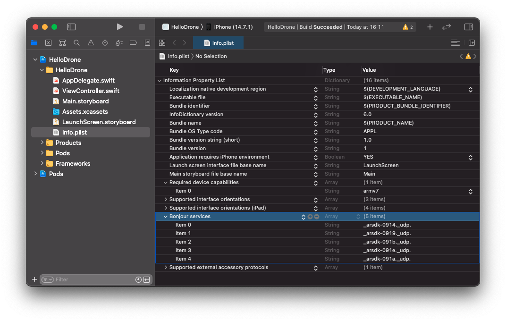

GroundSdk Hello Drone Tutorial
==============================

*GroundSdk Hello Drone Tutorial* is a step-by-step guide that helps you
develop an iOS application using GroundSdk iOS |version|.
This application is able to connect to an Anafi drone and a Skycontroller 3
remote control, display the battery level and video stream, and take off or
land the drone.

At the end of this tutorial, you will be able to:

- Setup your developement environment
- Setup your project to use GroundSdk iOS |version|
- Connect to a drone
- Display drone connection state
- Display drone battery level
- Make take off and land the drone
- Display the video live stream
- Connect to a remote control
- Display remote control connection state
- Display remote control battery level

The full project is available `here <https://github.com/Parrot-Developers/groundsdk-ios-samples/tree/master/HelloDrone>`__.

.. Note:: This tutorial is based on GroundSdk iOS version |version|.

Prerequisites
^^^^^^^^^^^^^

Before starting this tutorial, you have to:

 - `Install xcode`_
 - `Create a new project`_

	- Choose `Simple View App` as application template
	- Choose `Storyboard` as `User Interface`

.. _Install xcode: https://apps.apple.com/fr/app/xcode/id497799835?mt=12
.. _Create a new project: https://help.apple.com/xcode/mac/current/#/dev07db0e578

Setup project
^^^^^^^^^^^^^

First you need to configure your project to use GroundSdk iOS Pods.

Cocoapods install
-----------------

To install Cocoapods, open a Terminal and execute the folowing command.

.. code-block:: console

    $ sudo gem install cocoapods

Adding GroundSdk Pods
---------------------

Open `Terminal` and navigate to the directory that contains
your `HelloDrone` by using the `cd` command:

.. code-block:: console

    $ cd ~/Path/To/Folder/Containing/HelloDrone

Next, enter the following command:

.. code-block:: console

    $ pod init

This creates
a `Podfile <https://guides.cocoapods.org/using/the-podfile.html>`_ for
your project.

Open the Podfile using Xcode for
editing:

.. code-block:: console

    $ open -a Xcode Podfile

Replace all content with:

.. literalinclude:: ../HelloDrone/Podfile
   :language: ruby

.. Note:: replace `HelloDrone` by your own project name.

Save and close the Podfile.

You now need to tell CocoaPods to install the dependencies for your
project. Enter the following command in `Terminal`, after ensuring you are
still in the directory containing the `HelloDrone` project and Podfile:

.. code-block:: console

    $ pod install

**Open the project folder using Finder, and open the new
`HelloDrone.xcworkspace` file created by CocoaPods.**

Allow Network Discovery
-----------------------

You need to setup your project to allow device network discovery.

Add to your `Info.plist` file a new array with
`Bonjour services` as key and add string items
with services types to allow as value.

* `_arsdk-0914._udp.` for Anafi 4K
* `_arsdk-0919._udp.` for Anafi Thermal
* `_arsdk-091b._udp.` for Anafi UA
* `_arsdk-091e._udp.` for Anafi USA

Your `Info.plist` file should now look like this:

Your project setup is ready, let's start coding!

GroundSdk instance
^^^^^^^^^^^^^^^^^^

In order to use GroundSdk in your application, you first have to create
an keep a `GroundSdk`_ instance. So open your ViewController file, and add:

.. literalinclude:: ../HelloDrone/HelloDrone/ViewController.swift
   :language: swift
   :lines: 30-33, 39-42, 45, 82-84, 135, 335
   :emphasize-lines: 2-3, 7-8

This `GroundSdk`_ instance keeps and manages all GroundSdk references.

.. _GroundSdk: https://developer.parrot.com/docs/refdoc-ios/Classes/GroundSdk.html

Drone connection
^^^^^^^^^^^^^^^^

To connect to a drone, you should use the `AutoConnection`_ facility.

In `viewDidLoad`, `get the facility`_ and `start it`_.

.. literalinclude:: ../HelloDrone/HelloDrone/ViewController.swift
   :language: swift
   :lines: 41-45, 82-84, 89-98, 133-135
   :emphasize-lines: 3-4, 9-20

Auto connection will automatically select and connect the device.

You need to monitor the `drone`_ change to stop using the old one and start
using the new one.

.. literalinclude:: ../HelloDrone/HelloDrone/ViewController.swift
   :language: swift
   :lines: 46-48, 81-84, 89-104, 108-115, 133-136, 147-148, 160-163, 171
   :emphasize-lines:  1-3, 19-31, 36-38, 40-42

.. _AutoConnection: https://developer.parrot.com/docs/refdoc-ios/Protocols/AutoConnection.html
.. _get the facility: https://developer.parrot.com/docs/refdoc-ios/Classes/GroundSdk.html#/s:9GroundSdkAAC11getFacility_8observerAA3RefCy11ApiProtocolQzGx_yAHSgctAA0D9ClassDescRzlF
.. _start it: https://developer.parrot.com/docs/refdoc-ios/Protocols/AutoConnection.html#/c:@M@GroundSdk@objc(pl)GSAutoConnection(im)start
.. _drone: https://developer.parrot.com/docs/refdoc-ios/Protocols/AutoConnection.html#/c:@M@GroundSdk@objc(pl)GSAutoConnection(py)drone

Drone monitoring
^^^^^^^^^^^^^^^^

Now you will monitor and display the drone connection state and its battery
state.

Drone user interface
--------------------

To display drone information, add two UILabels in your `storyboard`_.
One for the Drone connection state, referencing to a `droneStateTxt` `UILabel` `IBOutlet` and
one for the Drone battery level, referencing to a `droneBatteryTxt` `UILabel` IBOutlet`.

Your `storyboard` should look like this:

And your addings in your `ViewController` should be:

.. literalinclude:: ../HelloDrone/HelloDrone/ViewController.swift
   :language: swift
   :lines: 46-48, 59, 68, 71-74
   :emphasize-lines: 5-

.. _storyboard: https://help.apple.com/xcode/mac/current/#/devf60c1c514

Drone state monitoring
----------------------

In order to display the drone connection state, set an observer on the
`drone state`_, and get its `ConnectionState <https://developer.parrot.com/docs/refdoc-ios/Classes/DeviceState.html#/c:@M@GroundSdk@objc(cs)GSDeviceState(py)connectionState>`__.

When you have finished with it and you want to stop monitoring it,
set the drone state reference to `nil`.

.. literalinclude:: ../HelloDrone/HelloDrone/ViewController.swift
   :language: swift
   :lines: 46-50, 59, 68, 71-74, 81, 148-150, 160-166, 171-172, 196-208
   :emphasize-lines: 4-5, 14-15, 20-22, 25-

.. _drone state: https://developer.parrot.com/docs/refdoc-ios/Classes/Drone.html#/s:9GroundSdk5DroneC8getState8observerAA3RefCyAA06DeviceE0CGyAISgc_tF

Drone battery monitoring
------------------------

In order to display the drone battery level, monitor the drone
`battery info instrument`_, using
`getInstrument <https://developer.parrot.com/docs/refdoc-ios/Classes/Drone.html#/s:9GroundSdk5DroneC13getInstrument_8observerAA3RefCy11ApiProtocolQzGx_yAISgctAA0E9ClassDescRzlF>`__,
then get its `batteryLevel`_.

.. literalinclude:: ../HelloDrone/HelloDrone/ViewController.swift
   :language: swift
   :lines: 46-52, 59, 68, 71-74, 81, 148-153, 160-167, 171,172, 209-221
   :emphasize-lines: 6-7, 19-20, 28, 31-

.. _battery info instrument: https://developer.parrot.com/docs/refdoc-ios/Protocols/BatteryInfo.html
.. _batteryLevel: https://developer.parrot.com/docs/refdoc-ios/Protocols/BatteryInfo.html#/s:9GroundSdk11BatteryInfoP12batteryLevelSivp

Reset drone user interface
--------------------------

When view did load and when you stop monitoring a drone,
you have to reset the drone user interface to prevent garbage display.

.. literalinclude:: ../HelloDrone/HelloDrone/ViewController.swift
   :language: swift
   :lines: 82-86, 88-115, 133-141, 145
   :emphasize-lines: 4-5, 24-25, 38-

Take off / land button
^^^^^^^^^^^^^^^^^^^^^^

Now you will add a button to enable take off and landing.

Button layout
-------------

In your layout, add a button at the bottom of the screen.
Make it referencing to a `takeOffLandBt` `UIButton` `IBOutlet`.
Bind it `Touch Up Inside` with a `takeOffLandBtAction` function.

Your `storyboard` should look like this:

And in your `ViewController` you should have:

.. literalinclude:: ../HelloDrone/HelloDrone/ViewController.swift
   :language: swift
   :lines: 68, 71-74, 79-81, 271-272, 284
   :emphasize-lines: 6-7, 9-

Manual piloting monitor
-----------------------

In order to pilot the drone, you have to use the
`Manual Copter Piloting Interface`_.

Monitor it using `getPilotingItf`_,
and update the button view according to the availability of these actions
(`canTakeOff`_ / `canLand`_).

.. literalinclude:: ../HelloDrone/HelloDrone/ViewController.swift
   :language: swift
   :lines: 46-54, 59, 68, 71-74, 79-81, 148-156, 160-162, 163-168, 171-172, 222-269
   :emphasize-lines: 8-9, 26-27, 36, 39-

.. _Manual Copter Piloting Interface: https://developer.parrot.com/docs/refdoc-ios/Protocols/ManualCopterPilotingItf.html
.. _getPilotingItf: https://developer.parrot.com/docs/refdoc-ios/Classes/Drone.html#/s:9GroundSdk5DroneC14getPilotingItf_8observerAA3RefCy11ApiProtocolQzGx_yAISgctAA0eF9ClassDescRzlF
.. _canTakeOff: https://developer.parrot.com/docs/refdoc-ios/Protocols/ManualCopterPilotingItf.html#/c:@M@GroundSdk@objc(pl)GSManualCopterPilotingItf(py)canTakeOff
.. _canLand: https://developer.parrot.com/docs/refdoc-ios/Protocols/ManualCopterPilotingItf.html#/c:@M@GroundSdk@objc(pl)GSManualCopterPilotingItf(py)canLand

Take off / landing requests
---------------------------

Now you need to `take off`_ or `land`_ the drone when the button is clicked,
according to their availabilities.

.. literalinclude:: ../HelloDrone/HelloDrone/ViewController.swift
   :language: swift
   :lines: 271-285
   :emphasize-lines: 3-13

.. _take off: https://developer.parrot.com/docs/refdoc-ios/Protocols/ManualCopterPilotingItf.html#/c:@M@GroundSdk@objc(pl)GSManualCopterPilotingItf(im)takeOff
.. _land: https://developer.parrot.com/docs/refdoc-ios/Protocols/ManualCopterPilotingItf.html#/c:@M@GroundSdk@objc(pl)GSManualCopterPilotingItf(im)land

Video stream
^^^^^^^^^^^^

The next step will allow you to add a live stream video view.

Video layout
------------

In your `storyboard`, add a `GLKit View` with `GSStreamView` as custom class. (`GSStreamView` is the `Objective-C` name of `StreamView`_)

Make it referencing to a `streamView` `StreamView`_ `IBOutlet`.

Your `storyboard` should now look like this:

And in your `ViewController` you should have:

.. literalinclude:: ../HelloDrone/HelloDrone/ViewController.swift
   :language: swift
   :lines: 68-74, 79-80
   :emphasize-lines: 2-3

.. _StreamView: https://developer.parrot.com/docs/refdoc-ios/Classes/StreamView.html

Video display
-------------

In order to display the live video stream in the StreamView, you need to:

- Monitor the `stream server peripheral`_
- `Monitor its live stream`_
- `Start to play`_ the stream
- `Attach this stream to your StreamView`_
- Detach the stream from the StreamView when you want to stop rendering the
  stream

.. literalinclude:: ../HelloDrone/HelloDrone/ViewController.swift
   :language: swift
   :lines: 46-59, 68-74, 79-81, 137-195
   :emphasize-lines: 10-13, 31-32, 46-47, 57, 61-

.. _stream server peripheral: https://developer.parrot.com/docs/refdoc-ios/Protocols/StreamServer.html
.. _Monitor its live stream: https://developer.parrot.com/docs/refdoc-ios/Protocols/StreamServer.html#/s:9GroundSdk12StreamServerP4live8observerAA3RefCyAA10CameraLive_pGyAaH_pSgc_tF
.. _Start to play: https://developer.parrot.com/docs/refdoc-ios/Protocols/CameraLive.html#/c:@M@GroundSdk@objc(pl)GSCameraLive(im)play
.. _Attach this stream to your StreamView: https://developer.parrot.com/docs/refdoc-ios/Classes/StreamView.html#/c:@M@GroundSdk@objc(cs)GSStreamView(im)setStreamWithStream:

Remote control
^^^^^^^^^^^^^^

In this section you will see how to connect to a remote control, display its
connection state and battery level.

Setup project
-------------

You need to setup your project to support remote controls.

Add to your `Info.plist` file a new array with
`Supported external accessory protocols` as key and add to it a string item
with the value `com.parrot.dronesdk`

Your `Info.plist` file should now look like this:

Remote control connection
-------------------------

You can use the `auto connection facility`_ as with the drone, and get the
`remote control`_ from it.

.. literalinclude:: ../HelloDrone/HelloDrone/ViewController.swift
   :language: swift
   :lines: 41-45, 60-62, 67, 82-86, 88-119, 123-136, 293-294, 300-303, 308
   :emphasize-lines: 6-8, 44-56, 61-63, 65-67

.. _auto connection facility: https://developer.parrot.com/docs/refdoc-ios/Protocols/AutoConnection.html
.. _remote control: https://developer.parrot.com/docs/refdoc-ios/Protocols/AutoConnection.html#/c:@M@GroundSdk@objc(pl)GSAutoConnection(py)remoteControl

Remote control user interface
-----------------------------

To display remote control information, add UILabels in your `storyboard`_.
One for the remote control connection state, referencing to a `remoteStateTxt` `UILabel` `IBOutlet` and
one for the remote control battery level, referencing to a `remoteBatteryTxt` `UILabel` IBOutlet`.

Your `storyboard` should look like this:

And with the reset of the remote user interface,
your `ViewController` you should have:

.. literalinclude:: ../HelloDrone/HelloDrone/ViewController.swift
   :language: swift
   :lines: 68-81, 82-136, 286-291
   :emphasize-lines: 8-11, 20, 53-54, 70-

Remote control state and battery
--------------------------------

As with the drone, set an observer on the `remote control state`_ to display
its `connectionState <https://developer.parrot.com/docs/refdoc-ios/Classes/DeviceState.html#/s:9GroundSdk11DeviceStateC010ConnectionD0O>`__.

Then monitor the `battery info instrument`_, using
`getInstrument <https://developer.parrot.com/docs/refdoc-ios/Classes/RemoteControl.html#/s:9GroundSdk13RemoteControlC13getInstrument_8observerAA3RefCy11ApiProtocolQzGx_yAISgctAA0F9ClassDescRzlF>`__
and display its `batteryLevel`_.

Finally, set to `nil` the remote control references to stop monitoring them.

.. literalinclude:: ../HelloDrone/HelloDrone/ViewController.swift
   :language: swift
   :lines: 60-67, 293-334
   :emphasize-lines: 4-7, 11-15, 20-23, 26-

.. _remote control state: https://developer.parrot.com/docs/refdoc-ios/Classes/RemoteControl.html#/s:9GroundSdk13RemoteControlC8getState8observerAA3RefCyAA06DeviceF0CGyAISgc_tF
.. _battery info instrument: https://developer.parrot.com/docs/refdoc-ios/Protocols/BatteryInfo.html
.. _batteryLevel: https://developer.parrot.com/docs/refdoc-ios/Protocols/BatteryInfo.html#/s:9GroundSdk11BatteryInfoP12batteryLevelSivp

Full project sources
^^^^^^^^^^^^^^^^^^^^

Thank you for having followed this tutorial. Hoping it was helpful to you.

You can find the full project on `github`_.

Please feel free to ask questions on the `Parrot forum for developers`_.

Wish you all the best with `GroundSdk <https://developer.parrot.com/>`__!

.. _github: https://github.com/Parrot-Developers/groundsdk-ios-samples/tree/master/HelloDrone
.. _Parrot forum for developers: https://forum.developer.parrot.com/
